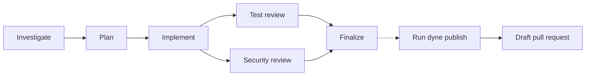

# dyne

dyne runs coding agents in bounded Kubernetes sandboxes and coordinates their work from task to pull request.

An agent bundles instructions, skills, setup, storage, and runtime limits. A session runs one agent against a Git repository in a Kubernetes `Job`. A workflow connects multiple sessions, passes structured results and Git patches between them, and runs independent steps in parallel.

dyne retains logs and validated artifacts, so work continues after the client disconnects. Publishing is always a separate, explicit action.

## Core concepts

| Concept     | What dyne owns                                                                                                                     |
| ----------- | ---------------------------------------------------------------------------------------------------------------------------------- |
| Sandbox     | One bounded Kubernetes `Job` for each coding task, with an isolated workspace and explicit resource and security settings.         |
| Agent       | A reusable, server-configured definition containing instructions, skills, setup, clone depth, storage, and timeout.                |
| Skill       | An instruction-only `SKILL.md` file mounted into the agent's Codex home for the task.                                              |
| Session     | The durable identity, task history, workspace policy, logs, and validated results for one agent working in one repository.         |
| Workflow    | A durable graph of isolated agent sessions with dependencies, bounded parallelism, structured output, and optional patch handoffs. |
| Artifact    | A validated outcome, pull-request draft, workflow result, or content-addressed Git patch produced by a task.                       |
| Publication | An explicit, recoverable operation that turns one completed persistent session into a new branch and pull request.                 |

SQL is the source of truth for session, workflow, and publication state. Kubernetes is the execution layer. Each initial or continued task becomes a `Job`; ephemeral sessions use pod-owned storage, and persistent sessions use a PVC. The CLI talks only to the dyne server.

## How a sandbox runs

Each task uses an ordered init-container chain before the coding agent starts:

```mermaid
flowchart LR
    intent[Durable task intent] --> directories[Create session directories]
    directories --> clone[repo-init: clone repository]
    clone --> patch[change-init: verify and apply optional patch]
    patch --> setup[workspace-init: run setup]
    setup --> auth[auth-init: prepare Codex auth]
    auth --> agent[agent: run bounded Codex task]
    agent --> results[Validate outcome and artifacts]
```



`repo-init` checks out the requested ref and records its base commit. It is the only session container that mounts the short-lived GitHub credential. The main coding-agent container receives neither that credential nor a Kubernetes service-account token.

When a workflow step receives an earlier change, `change-init` mounts the producer's PVC read-only. It verifies the patch's SHA-256 digest and byte count, then applies the patch to the fresh clone before setup runs.

## Built-in engineering workflows

Use one configured agent for a focused task, or use a workflow to divide a change across agents with different responsibilities.

`engineering-change` investigates and plans before implementation, then runs test and security review in parallel:



`focused-change` follows Implement → Test review → Finalize. Each step gets its own session and workspace. Direct dependencies pass structured JSON results to the next step. A step can also receive a validated Git patch from one direct dependency.

No workflow creates a remote branch or pull request until you run `dyne publish`.

## Prerequisites

Before you start the server, provide:

- Go 1.26.7 to build from source.
- A Kubernetes cluster and an existing namespace for the server and its Jobs.
- A storage class that supports the `ReadWriteOnce` PVCs used by persistent sessions.
- A coding-agent image that cluster nodes can pull. The default image name is `coding-agent:local`.
- A same-namespace Secret named `coding-agent-auth`. It must contain either `auth.json` or `CODEX_API_KEY` for coding tasks to authenticate.
- A GitHub App installation that can clone target repositories and create pull requests. Give the server its App ID, installation ID, and RSA private-key file.
- An application database. Use SQLite for one local server process. Use PostgreSQL when the database must survive replacement of the server.

The server does not check `coding-agent-auth` when it starts. A task that needs Codex authentication will fail if the Secret is absent or invalid.

Build the binary and coding-agent image:

```bash
make doctor
mkdir -p bin
make build BINARY=./bin/dyne
make image
```

`make image` uses the Docker context in `DOCKER_CONTEXT` and tags the image in `IMAGE`. Their defaults are `colima-codex-k8s` and `coding-agent:local`.

## Start the control plane

The server defaults to `127.0.0.1:8080`, namespace `coding-agents`, a `10Gi` persistent claim, and a two-hour task timeout.

For local use with a kubeconfig:

```bash
./bin/dyne server \
  --kubeconfig "$KUBECONFIG" \
  --context coding-agents \
  --namespace coding-agents \
  --image coding-agent:local \
  --database-url sqlite:dyne.db \
  --github-app-id 123 \
  --github-installation-id 456 \
  --github-private-key-file /secure/dyne-app.pem
```

For a Kubernetes Service, make the server listen on its pod interface. Keep the Service private, for example as a `ClusterIP` service protected by a network policy.

```bash
./bin/dyne server --listen 0.0.0.0:8080 [other server options]
```

The server selects Kubernetes credentials in this order:

1. `--eks-cluster`, with the optional `--aws-region` and `--aws-role-arn`.
2. `--kubeconfig` or `--context`.
3. In-cluster service-account credentials.
4. The standard local kubeconfig.

Do not combine `--eks-cluster` with `--kubeconfig` or `--context`.

### Server configuration

| Option             | Purpose                                                                                                         |
| ------------------ | --------------------------------------------------------------------------------------------------------------- |
| `--listen`         | HTTP listen address. The default is `127.0.0.1:8080`.                                                           |
| `--namespace`      | Kubernetes namespace that this server owns. The default is `coding-agents`.                                     |
| `--image`          | Coding-agent image. The default is `coding-agent:local`.                                                        |
| `--storage-size`   | Default persistent-session PVC size. The default is `10Gi`.                                                     |
| `--task-timeout`   | Default task deadline. The default is `2h`.                                                                     |
| `--database-url`   | `sqlite:path`, `postgres://...`, or `postgresql://...`. It defaults to `DYNE_DATABASE_URL` or `sqlite:dyne.db`. |
| `--agents-file`    | Custom agent catalog. It replaces the built-in catalog.                                                         |
| `--workflows-file` | Custom workflow catalog. It requires `--agents-file`.                                                           |

The server applies database schema updates at startup. SQLite uses one connection and a local file with restrictive permissions. PostgreSQL is the safer choice when the database must outlive one local process.

## Run an agent

Set `DYNE_SERVER` when the client cannot use the default `http://127.0.0.1:8080` address. You can also pass `--server` to every client command.

```bash
export DYNE_SERVER=http://127.0.0.1:8080

./bin/dyne agents

./bin/dyne start \
  --agent implementer \
  --name parser-fix \
  --repo https://github.com/example/project.git \
  --ref main \
  --prompt 'Fix the parser bug and run the parser tests.'
```

The server resolves the selected agent into an immutable session definition. The client supplies only the session name, repository, ref, prompt, and optional timeout. It cannot replace the agent's instructions, skills, setup command, clone depth, or storage policy.

The task is accepted after its intent is stored in SQL and Kubernetes accepts its resources. The client can then disconnect.

```bash
./bin/dyne status --name parser-fix
./bin/dyne logs --name parser-fix --follow
./bin/dyne artifacts --name parser-fix
```

`logs --follow` streams newline-delimited JSON. `artifacts` returns the latest finished task's validated outputs.

### Session storage and continuation

| Session type | Behavior                                                                                                                                |
| ------------ | --------------------------------------------------------------------------------------------------------------------------------------- |
| Ephemeral    | Uses pod-owned temporary storage for one task. The workspace is read-only while the agent runs. The session cannot continue or publish. |
| Persistent   | Retains the workspace, tool home, Codex state, logs, and artifacts on one PVC. A completed session can continue or publish.             |

Continue a persistent session with another bounded `Job`:

```bash
./bin/dyne task \
  --name parser-fix \
  'Address the remaining failed test.'
```

Only one task can be active in a persistent session. dyne records the new task in SQL before creating Kubernetes resources.

Delete compute resources while keeping a persistent session's PVC and SQL record:

```bash
./bin/dyne delete --name parser-fix
```

Delete the persistent storage and durable state as well:

```bash
./bin/dyne delete --name parser-fix --storage
```

If cleanup stops partway through, the server continues it when it next starts.

## Artifacts and patch handoffs

Every task must report an outcome with a status, summary, and blocker. A successful task also reports the result required by its role:

- A standalone or publishable session produces pull-request title and body metadata.
- A workflow step produces a size-limited JSON object for its direct dependents.
- A persistent workflow step whose change is needed later produces a content-addressed Git patch.

After a patch-producing step completes, the container stages the workspace and writes a binary, full-index diff from the base commit recorded by `repo-init`. It stores the patch as `/artifacts/changes/<sha256>.patch` on the session PVC and reports its SHA-256 digest and byte count. The control plane validates and stores this metadata without loading the patch contents into SQL.

A workflow consumer selects one direct dependency with `change_from`. dyne adds the producer session and patch metadata to the consumer's durable task intent. The consumer starts from its own clean clone, mounts the producer PVC read-only, verifies the patch, and applies it with `git apply --index --binary`. It then runs its setup command and agent. Reviewers and finishers receive the implementation change without sharing a writable workspace.

## Run a workflow

A workflow is a validated dependency graph of agent sessions. The scheduler starts ready steps up to `max_parallelism` and skips steps whose dependencies do not complete. It stores run and step state so reconciliation can continue after a server restart.

Each run snapshots the selected workflow and agent definitions before it starts the first session.

The built-in catalog contains these agents:

| Agent               | Storage    | Role                                                           |
| ------------------- | ---------- | -------------------------------------------------------------- |
| `investigator`      | Ephemeral  | Examine the current code and recommend what to change.         |
| `planner`           | Ephemeral  | Write an implementation plan from the investigation results.   |
| `implementer`       | Persistent | Make the code change and retain it for later steps.            |
| `test-reviewer`     | Ephemeral  | Check whether the tests prove the changed behavior.            |
| `security-reviewer` | Ephemeral  | Check changed trust boundaries and concrete exploit paths.     |
| `finisher`          | Persistent | Fix review findings, run final checks, and prepare the change. |

It also contains these workflows:

| Workflow             | Steps                                                                | Parallelism |
| -------------------- | -------------------------------------------------------------------- | ----------- |
| `focused-change`     | Implement, test review, finalize                                     | 1           |
| `engineering-change` | Investigate, plan, implement, test review, security review, finalize | 2           |

List and start workflows:

```bash
./bin/dyne workflows

./bin/dyne workflow-start \
  --workflow focused-change \
  --name change-123 \
  --repo https://github.com/example/project.git \
  --ref main \
  --prompt 'Fix the parser bug. Keep the current API behavior.'
```

Inspect or control a run:

```bash
./bin/dyne workflow-status --name change-123
./bin/dyne workflow-artifacts --name change-123
./bin/dyne workflow-cancel --name change-123
./bin/dyne workflow-delete --name change-123
```

`workflow-delete` accepts only a finished run. It deletes every step session and its saved files before removing the workflow record.

`workflow-artifacts` returns structured outputs and retained change metadata. It also returns `publishable_session` when the workflow has a session ready for publication.

## Define agents, skills, and workflows

An agents file is a YAML catalog. Each agent needs a description, storage type, and instructions. Optional shared guidance must name an `AGENTS.md` file. Every skill path must name a `SKILL.md` file. Guidance and skill paths must remain inside the catalog directory and cannot contain symlinks.

```yaml
version: v1
guidance: AGENTS.md

agents:
  reviewer:
    description: Review the requested change.
    storage: ephemeral
    instructions: Review correctness, security, and tests.
    skills:
      - skills/code-review/SKILL.md
    setup: mise install
    clone_depth: 1
    timeout: 2h
```

dyne reads each skill's name and description from its front matter. It mounts the complete file at `~/.agents/skills/<name>/SKILL.md` in the agent container. Shared guidance is prepended to the agent's own instructions.

Use `persistent` storage only when a session must continue, retain a patch for a later workflow step, or publish. `storage_size` is valid only for persistent agents.

Passing `--agents-file` replaces the built-in agents. Without `--workflows-file`, the server does not expose workflow routes. A custom workflow file must use the custom agent catalog.

A workflow can have one publishable leaf step. The source of a `change_from` patch must be a direct dependency.

## Publish a completed change

`dyne publish` works only after a persistent session completes successfully. The repository URL must be an HTTPS `github.com` owner/repository URL. The command requires a new branch and commit message. It uses the session's initial ref as the default pull-request base branch.

```bash
./bin/dyne publish \
  --name parser-fix \
  --branch dyne/parser-fix \
  --commit-message 'Fix parser edge case'
```

dyne creates a draft pull request by default. Pass `--ready` to create a ready-for-review pull request.

The publisher starts from a clean clone. It applies the retained patch when one is available; otherwise, it copies the completed workspace into the clone. It then commits the change, verifies the remote branch, and opens the pull request with the title and description supplied by the agent. It never force-pushes.

Run the same publish command again after a failure. dyne checks the durable publication state, remote branch, and pull request before it retries a non-idempotent operation.

## Deployment model

dyne does not deploy itself. This repository provides the server, CLI client, and coding-agent image. It does not include a Kubernetes Deployment, Service, ServiceAccount, RBAC policy, Helm chart, or Kustomize package.

One server owns one Kubernetes namespace. Only the server reads Kubernetes credentials and the long-lived GitHub App configuration. It loads the catalogs, stores application state in SQL, creates workload resources, and exposes the private HTTP API.

A session pod mounts a short-lived repository credential only in `repo-init`. The main agent container does not receive GitHub credentials or a Kubernetes service-account token.

Use dyne only for trusted repositories in a private cluster. The Kubernetes pod is the command-execution boundary, but it is not designed as hostile multi-tenant isolation. Codex runs inside the agent container with approvals and its own sandbox bypassed.

## Private HTTP API

The CLI uses these routes:

| Area                | Routes                                                                                                                                                                                                                                                   |
| ------------------- | -------------------------------------------------------------------------------------------------------------------------------------------------------------------------------------------------------------------------------------------------------- |
| Agents and sessions | `GET /v1/agents`, `POST /v1/agents/{agent}/sessions`, `GET /v1/sessions/{name}`, `POST /v1/sessions/{name}/tasks`, `GET /v1/sessions/{name}/logs`, `GET /v1/sessions/{name}/artifacts`, `POST /v1/sessions/{name}/publish`, `DELETE /v1/sessions/{name}` |
| Workflows           | `GET /v1/workflows`, `POST /v1/workflows/{workflow}/runs`, `GET /v1/workflow-runs/{name}`, `GET /v1/workflow-runs/{name}/artifacts`, `POST /v1/workflow-runs/{name}/cancel`, `DELETE /v1/workflow-runs/{name}`                                           |

Session creation and continuation return `202 Accepted` after Kubernetes accepts the resource. The logs route returns `application/x-ndjson`.

The API has no application authentication. Keep it behind a private network boundary.

## Security notes

- The HTTP API has no application authentication. Keep it on a private network.
- The server creates short-lived GitHub App installation tokens for clone init containers and publisher Jobs. It does not mount them in the coding-agent container.
- Agent definitions, instructions, skills, setup commands, prompts, repository URLs, and refs can appear in Kubernetes workload resources. Do not put secrets in them.
- Agent and publisher pods run as non-root UID/GID 1000. They use a read-only root filesystem, `RuntimeDefault` seccomp, no Linux capabilities, and no privilege escalation. Their service-account tokens are disabled. Ingress is denied, but egress is allowed.
- The database, workload resources, and server files can contain operational data. Limit who can read them.

## Development and tests

Use the ordinary checks for source changes:

```bash
make doctor
make test
make check
```

`make check` runs formatting checks, SQL generation checks, module checks, vet, lint, race tests, and a build. Run `make generate` only after changing SQL queries or schema.

Set the Kubernetes context when you run the integration test:

```bash
make integration-test KUBERNETES_INTEGRATION_CONTEXT=colima-codex-proof
```

The real coding-session E2E test builds an image, uses a Codex account, changes GitHub and Kubernetes state, and can leave resources after a hard interruption. Do not run it as an ordinary check. See the [live E2E runbook](test/e2e/README.md).
