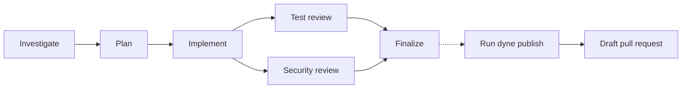

# dyne

dyne coordinates coding agents to investigate, plan, implement, review, and publish code changes.

Use one agent for a single task, or run a workflow with separate planning, implementation, test review, and security review steps. Tasks run in the cluster, so you can close the client and come back later. You can read the logs, continue a persistent session with another prompt, or publish the finished change.

`engineering-change` investigates and plans before implementation, then runs test and security review in parallel:



`focused-change` follows Implement → Test review → Finalize. Each workflow step gets its own workspace. Reviewers receive the proposed change and results from earlier steps. No remote branch or pull request is created until you run `dyne publish`. By default, the command opens a draft pull request and never force-pushes.

## Prerequisites

Before you start the server, provide these resources:

- Go 1.26.7 to build from source.
- A Kubernetes cluster and an existing namespace for the server and its Jobs.
- A storage class that supports the `ReadWriteOnce` PVCs used by persistent sessions.
- A coding-agent image that cluster nodes can pull. The default image name is `coding-agent:local`.
- A same-namespace Secret named `coding-agent-auth`. It must contain either `auth.json` or `CODEX_API_KEY` for coding tasks to authenticate.
- A GitHub App installation that can clone target repositories and create pull requests. Give the server its App ID, installation ID, and RSA private-key file.
- An application database. Use SQLite for one local server process. Use PostgreSQL when the database must survive replacement of the server.

The server does not check `coding-agent-auth` when it starts. A task that needs Codex authentication will fail if the Secret is absent or invalid.

Build the binary and image:

```bash
make doctor
mkdir -p bin
make build BINARY=./bin/dyne
make image
```

`make image` uses the Docker context in `DOCKER_CONTEXT` and tags the image in `IMAGE`. Their defaults are `colima-codex-k8s` and `coding-agent:local`.

## Start the server

The server defaults to `127.0.0.1:8080`, namespace `coding-agents`, a `10Gi` persistent claim, and a two-hour task timeout.

For local use with a kubeconfig:

```bash
./bin/dyne server \
  --kubeconfig "$KUBECONFIG" \
  --context coding-agents \
  --namespace coding-agents \
  --image coding-agent:local \
  --database-url sqlite:dyne.db \
  --github-app-id 123 \
  --github-installation-id 456 \
  --github-private-key-file /secure/dyne-app.pem
```

For a Kubernetes Service, make the server listen on its pod interface. Keep the Service private, for example as a `ClusterIP` service protected by your network policy.

```bash
./bin/dyne server --listen 0.0.0.0:8080 [other server options]
```

The server selects Kubernetes credentials in this order:

1. `--eks-cluster`, with the optional `--aws-region` and `--aws-role-arn`.
2. `--kubeconfig` or `--context`.
3. In-cluster service-account credentials.
4. The standard local kubeconfig.

Do not combine `--eks-cluster` with `--kubeconfig` or `--context`.

### Server configuration

| Option             | Purpose                                                                                                         |
| ------------------ | --------------------------------------------------------------------------------------------------------------- |
| `--listen`         | HTTP listen address. The default is `127.0.0.1:8080`.                                                           |
| `--namespace`      | Kubernetes namespace that this server owns. The default is `coding-agents`.                                     |
| `--image`          | Coding-agent image. The default is `coding-agent:local`.                                                        |
| `--storage-size`   | Default persistent-session PVC size. The default is `10Gi`.                                                     |
| `--task-timeout`   | Default task deadline. The default is `2h`.                                                                     |
| `--database-url`   | `sqlite:path`, `postgres://...`, or `postgresql://...`. It defaults to `DYNE_DATABASE_URL` or `sqlite:dyne.db`. |
| `--agents-file`    | Custom agent catalog. It replaces the built-in catalog.                                                         |
| `--workflows-file` | Custom workflow catalog. It requires `--agents-file`.                                                           |

The server applies database schema updates at startup. SQLite uses one connection and a local file with restrictive permissions. PostgreSQL is the safer choice when the database must outlive one local process.

## Run a session

Set `DYNE_SERVER` when the client cannot use the default `http://127.0.0.1:8080` address. You can also pass `--server` to every client command.

```bash
export DYNE_SERVER=http://127.0.0.1:8080

./bin/dyne agents

./bin/dyne start \
  --agent implementer \
  --name parser-fix \
  --repo https://github.com/example/project.git \
  --ref main \
  --prompt 'Fix the parser bug and run the parser tests.'
```

The agent definition sets its instructions, skills, setup command, clone depth, storage type, storage size, and default timeout. The client supplies the session name, repository, ref, prompt, and optional timeout. It cannot change the agent settings.

Observe the task:

```bash
./bin/dyne status --name parser-fix
./bin/dyne logs --name parser-fix --follow
./bin/dyne artifacts --name parser-fix
```

`logs --follow` streams newline-delimited JSON. A finished task returns its outcome. Completed standalone tasks also return pull-request metadata. Completed workflow steps can return a size-limited JSON result and a saved Git patch.

### Session storage and cleanup

| Session type | Behavior                                                                                                                                     |
| ------------ | -------------------------------------------------------------------------------------------------------------------------------------------- |
| Ephemeral    | The session workspace uses temporary storage. You cannot continue or publish the session.                                                    |
| Persistent   | The session retains its workspace, tool home, Codex state, logs, and artifacts on one PVC. You can continue and publish a completed session. |

Continue a persistent session:

```bash
./bin/dyne task \
  --name parser-fix \
  'Address the remaining failed test.'
```

Only one task can be active in a persistent session. dyne writes the new task to SQL before it creates Kubernetes resources.

Delete compute resources while keeping a persistent session's PVC and SQL record:

```bash
./bin/dyne delete --name parser-fix
```

Delete the persistent storage and state as well:

```bash
./bin/dyne delete --name parser-fix --storage
```

If cleanup stops partway through, the server continues it when it next starts.

## Publish a completed change

`dyne publish` works only after a persistent session completes successfully. The repository URL must be an HTTPS `github.com` owner/repository URL. The command requires a new branch and commit message. It uses the session's initial ref as the default pull-request base branch.

```bash
./bin/dyne publish \
  --name parser-fix \
  --branch dyne/parser-fix \
  --commit-message 'Fix parser edge case'
```

dyne creates a draft pull request by default. Pass `--ready` to create a ready-for-review pull request.

The publisher starts from a clean clone. It applies the saved change, commits it, checks the remote branch, and opens the pull request with the title and description from the agent. It does not force-push. Run the same publish command again after a failure; dyne finds the existing branch or pull request instead of creating another one.

## Run a workflow

A workflow defines dependencies between sessions. Steps do not share a writable workspace. With `change_from`, a step can receive a Git patch from one of its direct dependencies. Each run saves the selected workflow and agent settings before it starts any session.

The built-in catalog contains these agents:

| Agent               | Storage    | Role                                                           |
| ------------------- | ---------- | -------------------------------------------------------------- |
| `investigator`      | Ephemeral  | Examine the current code and recommend what to change.         |
| `planner`           | Ephemeral  | Write an implementation plan from the investigation results.   |
| `implementer`       | Persistent | Make the code change and save it for later steps.              |
| `test-reviewer`     | Ephemeral  | Check whether the tests prove the changed behavior.            |
| `security-reviewer` | Ephemeral  | Check changed trust boundaries and ways to exploit the change. |
| `finisher`          | Persistent | Fix review findings, run final checks, and prepare the change. |

It also contains these workflows:

| Workflow             | Steps                                                                | Parallelism |
| -------------------- | -------------------------------------------------------------------- | ----------- |
| `focused-change`     | Implement, test review, finalize                                     | 1           |
| `engineering-change` | Investigate, plan, implement, test review, security review, finalize | 2           |

List and start workflows:

```bash
./bin/dyne workflows

./bin/dyne workflow-start \
  --workflow focused-change \
  --name change-123 \
  --repo https://github.com/example/project.git \
  --ref main \
  --prompt 'Fix the parser bug. Keep the current API behavior.'
```

Inspect and control a run:

```bash
./bin/dyne workflow-status --name change-123
./bin/dyne workflow-artifacts --name change-123
./bin/dyne workflow-cancel --name change-123
./bin/dyne workflow-delete --name change-123
```

`workflow-delete` accepts only a finished run. It deletes every step session and its saved files before it removes the workflow record. `workflow-artifacts` returns `publishable_session` when the workflow has a session that you can publish. Pass that name to `dyne publish`.

## Configure custom agents and workflows

An agents file is a YAML catalog. Each agent needs a description, storage type, and instructions. `guidance` and every skill path must stay inside the catalog directory. A skill path must name `SKILL.md`.

```yaml
version: v1
guidance: AGENTS.md

agents:
  reviewer:
    description: Review the requested change.
    storage: ephemeral
    instructions: Review correctness, security, and tests.
    skills:
      - skills/code-review/SKILL.md
    setup: mise install
    clone_depth: 1
    timeout: 2h
```

Use `persistent` storage only when a session must continue, save a patch for a later workflow step, or publish. `storage_size` is valid only for persistent agents.

Passing `--agents-file` replaces the built-in agents. Without `--workflows-file`, the server does not expose workflow routes. A custom workflow file must use the custom agent catalog. A workflow can have one publishable leaf step. The source of a `change_from` patch must be a direct dependency.

## Private HTTP API

The CLI uses these private routes:

| Area                | Routes                                                                                                                                                                                                                                                   |
| ------------------- | -------------------------------------------------------------------------------------------------------------------------------------------------------------------------------------------------------------------------------------------------------- |
| Agents and sessions | `GET /v1/agents`, `POST /v1/agents/{agent}/sessions`, `GET /v1/sessions/{name}`, `POST /v1/sessions/{name}/tasks`, `GET /v1/sessions/{name}/logs`, `GET /v1/sessions/{name}/artifacts`, `POST /v1/sessions/{name}/publish`, `DELETE /v1/sessions/{name}` |
| Workflows           | `GET /v1/workflows`, `POST /v1/workflows/{workflow}/runs`, `GET /v1/workflow-runs/{name}`, `GET /v1/workflow-runs/{name}/artifacts`, `POST /v1/workflow-runs/{name}/cancel`, `DELETE /v1/workflow-runs/{name}`                                           |

Session creation and continuation return `202 Accepted` after Kubernetes accepts the resource. The logs route returns `application/x-ndjson`.

## Deployment model

dyne does not deploy itself. This repository provides the server, client, and coding-agent image. It does not include a Kubernetes Deployment, Service, ServiceAccount, RBAC policy, Helm chart, or Kustomize package.

The `dyne` client calls one server to start work and read its status, logs, and artifacts. Only the server reads Kubernetes and GitHub credentials. It also loads the agent catalog and stores application state in SQL.

Run one server for one namespace. Restrict its Kubernetes identity to that namespace, and keep its HTTP endpoint on a private network. The API has no application authentication.

Use dyne only for trusted repositories in a private cluster. The coding-agent container runs Codex with approvals and its sandbox bypassed. The agent container has no GitHub credential or Kubernetes service-account token, but it can use its Codex credential and network access.

## Security notes

- The HTTP API has no application authentication. Keep it on a private network.
- The server creates short-lived GitHub App installation tokens for clone init containers and publisher Jobs. It does not mount them in the coding-agent container.
- Agent definitions, instructions, skills, setup commands, prompts, repository URLs, and refs can appear in Kubernetes workload resources. Do not put secrets in them.
- Agent and publisher Pods run as non-root UID/GID 1000. They use a read-only root filesystem, `RuntimeDefault` seccomp, no Linux capabilities, and no privilege escalation. Their service-account tokens are disabled. Ingress is denied, but egress is allowed.
- The database, workload resources, and server files can contain operational data. Limit who can read them.

## Development and tests

Use the ordinary checks for source changes:

```bash
make doctor
make test
make check
```

`make check` runs formatting checks, SQL generation checks, module checks, vet, lint, race tests, and a build. Run `make generate` only after you change the SQL queries or schema.

Set the Kubernetes context when you run the integration test:

```bash
make integration-test KUBERNETES_INTEGRATION_CONTEXT=colima-codex-proof
```

The real coding-session E2E test builds an image, uses a Codex account, changes GitHub and Kubernetes state, and can leave resources after a hard interruption. Do not run it as an ordinary check. See the [live E2E runbook](test/e2e/README.md).
